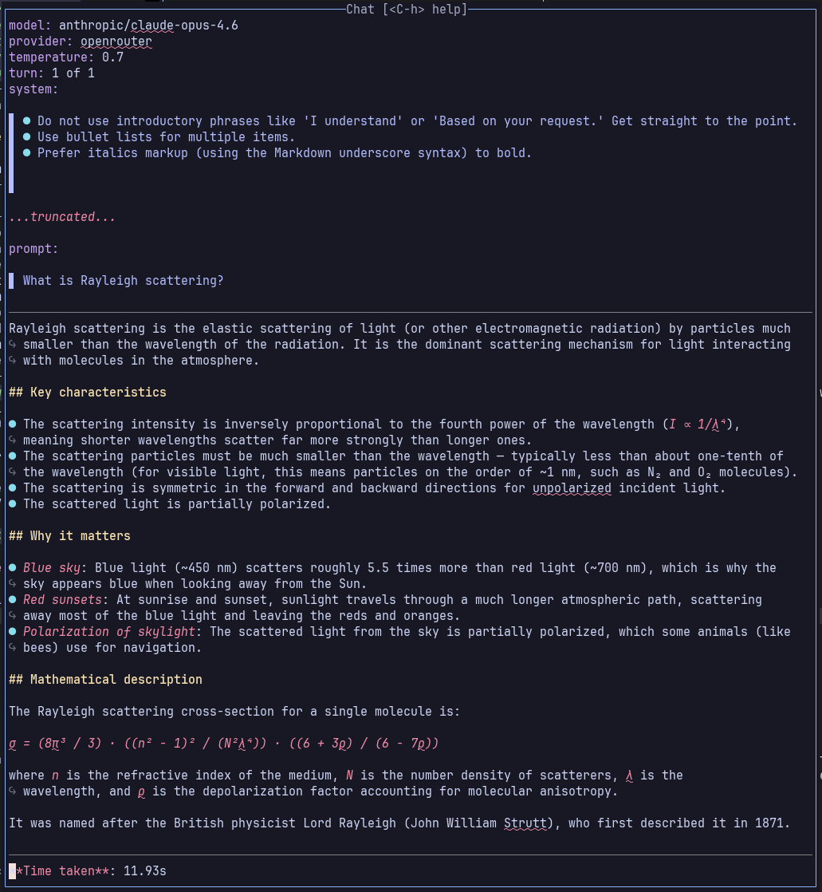
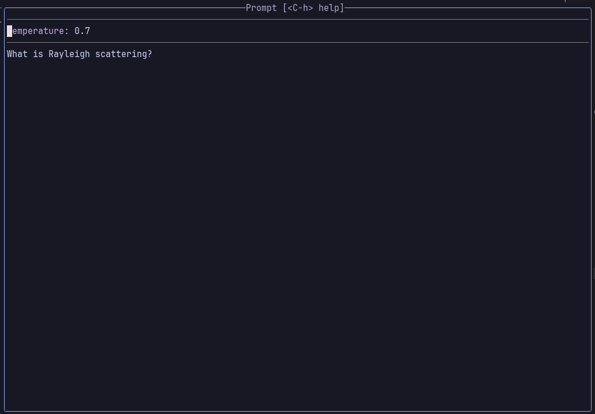
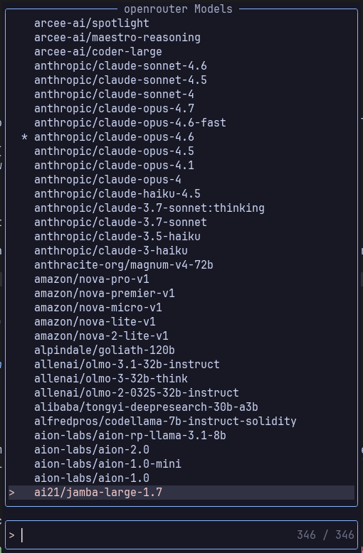
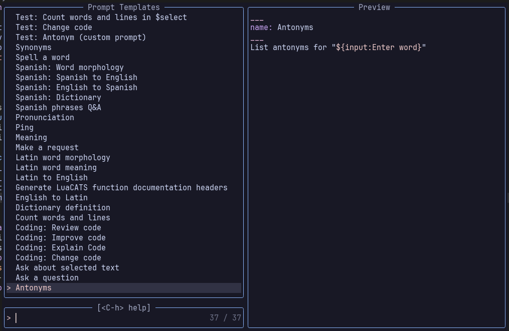
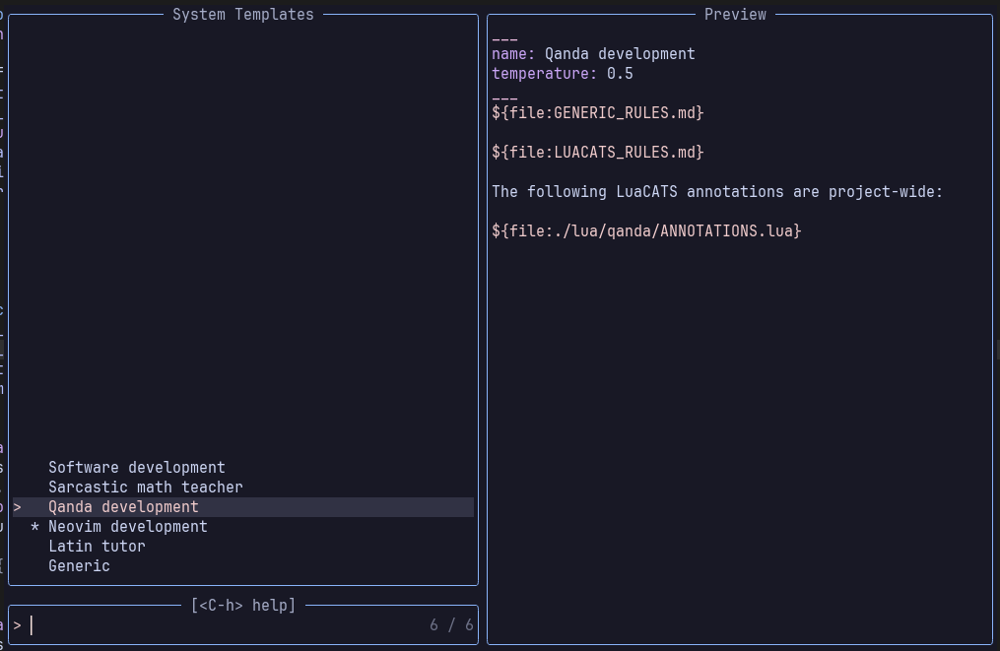
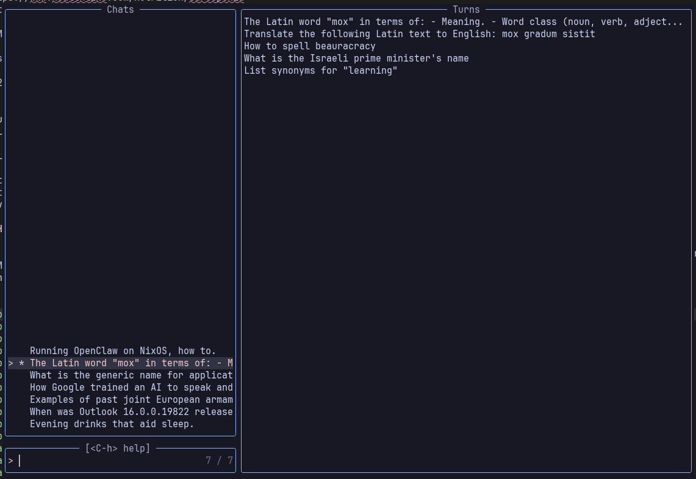
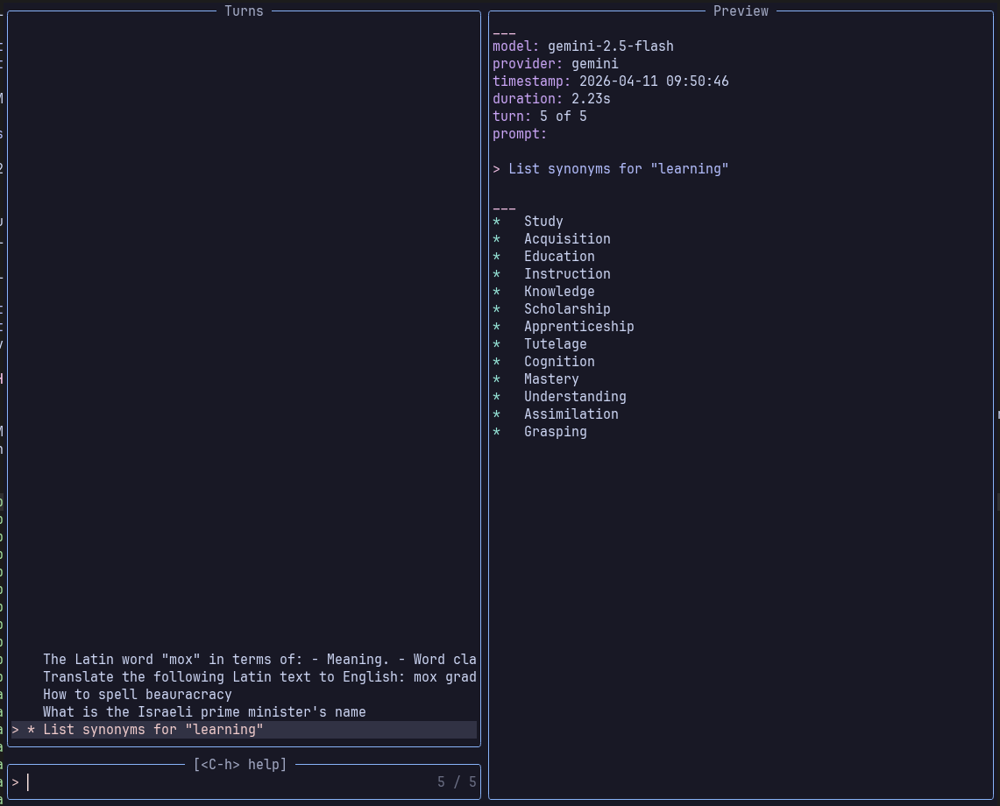
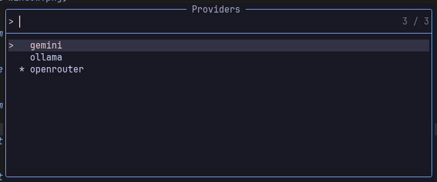
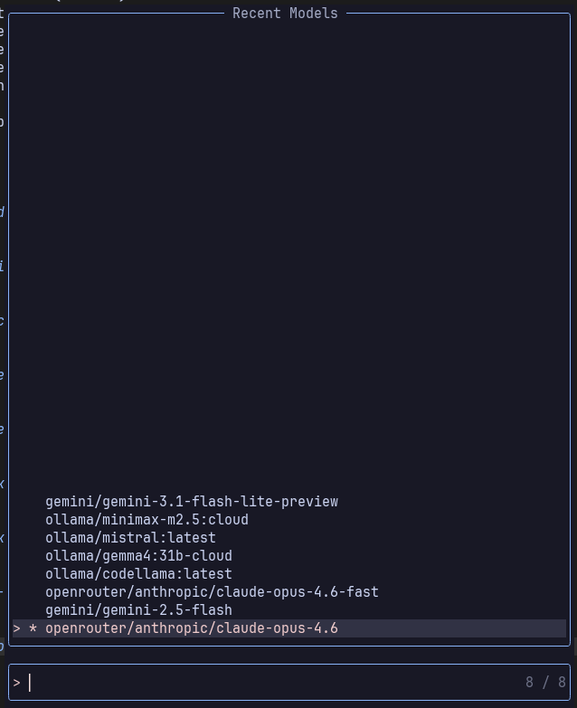

# qanda.nvim

Qanda is an AI chatbot for Neovim.

An easy-to-use Neovim plugin for conversing with AI models.

> [!IMPORTANT]
> This is the 1.0 release, I use it daily on NixOS Linux with Neovim v0.11.6, but haven't tested on other systems.

## Features

- Familiar turn-about chatbot UI.
- Chats are persistent, resumable and editable.
- Reusable named prompt templates for customisable user messages (prompts) and system messages.
- Ollama, OpenRouter and Google Gemini model providers.
- Models and providers can be switched at any time.

## Overview

- The user engages in interactive turn-about _chats_ (conversations) with the selected AI model.
- _Chats_ are contextual, persistent, resumable and editable.
- The chat comprises one or more _turns_ (model request + model response).
- A turn is initiated with a user _prompt_ (a question or an instruction)
- Chats can include an optional _system message_

## Rationale

Qanda is for getting answers interactively from an AI, not for automated workflow execution.

It is first and foremost designed for easy on-boarding with a familiar prompt/response chat UI that doesn't get in your way.

There are plenty of feature-rich AI applications AI plugins out there and most are not designed for quick-fire Q&A sessions. Many are task specific and most impose a significant cognitive load.

Qanda is light on token consumption: model requests are explicit (there are no hidden contexts or model requests).

## Tips

- The Chat and Prompt windows `<C-h>` help command displays a summary available window commands.
- Use the `:Qanda /dump_diagnostics` command to view the model request and response generated by the most recently executed turn.

- If Neovim is configured to persist the Neovim registers across sessions the Qanda `/dump_diagnostics` command will also persist across sessions. Set the maximum number of shada lines saved to accommodate the diagnostics e.g. to 999:

      vim.opt.shada = "!,'100,<999,s10,h"

- Executing a prompt template from the _Prompt picker_ previews the expanded prompt in the _Prompt window_; the preview is skipped if you execute a prompt template using the `:Qanda` command.

## Model options

Model options are passed through to the model, they include the likes of `temperature`, `max_tokens` etc. Model options are often provider or model specific. Options are merged from:

- Provider-specific configuration `model_options` (lowest priority)
- System message model options
- User prompt model options (highest priority)

## Template placeholders

The following placeholders can be used in prompt templates and system templates.

| Syntax                        | Description                                                       |
| ----------------------------- | ----------------------------------------------------------------- |
| `$input`, `${input:<prompt>}` | Prompts user for input and substitutes the value                  |
| `$clipboard`                  | Substitutes content of system clipboard (alias for `$register_+`) |
| `$yanked`                     | Substitutes most recently yanked text (alias for `$register_0`)   |
| `$filetype`                   | Substitutes current buffer's filetype                             |
| `$register_<register name>`   | Substitutes content of specified register                         |
| `${file:<file name>}`         | Inject text file                                                  |

- The `$select` placeholder allows the user to select from the `$clipboard`, `$text`, `$input` or `$yanked` inputs at the time of template substitution.
- The `$file` placeholder file location is determined by the file name directory prefix:
  - No directory prefix defaults to the Qanda `prompts` data directory e.g. `${file:AGENTS.md}`
  - A relative directory prefix is relative to the current working directory (reported by the `:pwd` command) e.g. `${file:./README.md}`
  - An absolute directory prefix can be used to specify any location e.g. `${file:~/.config/nvim/stylua.toml}`

## Prompt templates

TODO:

#### User prompts templates

- User prompt templates are named templates for model request `user` messages.
- Prompt templates files are named like `*.user.md`.
- They are stored in the directory set by the `prompts_dir` configuration option (`~/.local/share/nvim/qanda_nvim/prompts/` on most Linux systems).

Example template entry;

```
___
name: Latin: Latin to English
temperature: 0.2
___
Translate the following Latin text to English:

$select
```

## Prompt

A prompt is a user instruction or question sent to the AI model.

- A prompt is submitted for execution from the Prompt window or directly with a `:Qanda <prompt name>` command.
- A new prompt can be created with the `:Qanda /new_prompt` and `:Qanda /prompt_picker` commands or by resubmitting a previous prompt from the Chat window.

### Prompt window

The Prompt window is a floating window into which the user enters questions and instructions for the AI model. Prompt submission generates a model request which is saved, along with the model response, to a new chat Turn.

- The Prompt window implements the following key-mapped commands:
  - `<S-Enter>` - Submit the prompt to the current chat
  - `<C-s>` - Submit the prompt to a new chat
  - `<C-r>` - Submit the prompt to the current chat replacing the latest turn
  - `<C-Del>` - Clear the prompt window and enter insert mode
  - `<Tab>` - Switch to Chat window †
  - `<Esc>` - Close Prompt window †
  - `<Leader>fi` - Inject file(s) into the prompt †

## Data files

Qanda maintains a number of history and session data files:

- The `session.json` file contains the session state which is restored at startup. It contains:
  - Current provider and model names
  - Most recently used chat file name
  - Current system message template name
  - The list of recently used models
- The `chats` directory containing chat files.
- The `prompts` directory containing user prompt template files and system message template files.

## Data directories

Data files are sourced from two locations:

- The global Qanda data directory which is set by the `data_dir` configuration option (defaults to `vim.fn.stdpath "data" .. "/qanda_nvim"`).
- The optional Qanda local data directory `$PWD/.qanda_nvim`

If the optional local directory exists then it will contain the `session.json` and optional, the `prompts` and `chats` directories.

- The `chats` directory contains the saved chats history (one file per chat).
- The `prompts` directory contains the user prompt templates and system message templates.
- If there is no local `chats` folder Qanda uses the global `chats` folder.
- If there is no local `prompts` folder Qanda uses the global `prompts` folder.

This scheme allows you to selectively share session, prompt templates and chats across projects.

Local data storage is initiated by creating a directory called `.qanda_nvim` in the project root directory. Creating sub-directories `prompts` and `chats` will confine prompt templates and chats to the project, otherwise they are sourced from the global locations.

For example, the following command in the project root directory create the local data folder and a sub-folder for chats; since we didn't create a `prompts` templates folder, they will be sourced from the global data store:

    mkdir -p .qanda_nvim/chats

## Qanda commands

| Command                         | Description                                        |
| ------------------------------- | -------------------------------------------------- |
| `:Qanda Prompt template name`   | Execute a named prompt template                    |
| `:Qanda /abort`                 | Abort the current model request                    |
| `:Qanda /chat_picker`           | Open the Chat picker                               |
| `:Qanda /chat_window`           | Open the Chat window                               |
| `:Qanda /dump_diagnostics`      | Display diagnostics for the previous model request |
| `:Qanda /model_selector`        | Select a model from the current provider           |
| `:Qanda /new_chat`              | Start a new Chat                                   |
| `:Qanda /new_prompt`            | Open a new Prompt                                  |
| `:Qanda /prompt_picker`         | Open the Prompt picker                             |
| `:Qanda /prompt_window`         | Open the Prompt window                             |
| `:Qanda /provider_selector`     | Select a provider and a model                      |
| `:Qanda /recent_models`         | Select from the list of recent models              |
| `:Qanda /status`                | Print Qanda status information                     |
| `:Qanda /system_message_picker` | Open the System Message picker                     |
| `:Qanda /turn_picker`           | Open the chat Turn picker                          |

Qanda commands respond to tabbed command completion.

## Qanda user interface

The UI is implemented with Neovim floating windows.

| Name                   | Modal |
| ---------------------- | ----- |
| Chat window            | No    |
| Prompt window          | No    |
| Chat picker            | Yes   |
| Model picker           | Yes   |
| Prompt template picker | Yes   |
| Provider picker        | Yes   |
| Recent model picker    | Yes   |
| System template picker | Yes   |
| Turn picker            | Yes   |

- The `chat_window_mode` configuration option allows the chat window to be configured as a non-floating window and has the following option values:
  - `float`: Open in a floating window (default)
  - `normal`: Open in the current window
  - `top`: Horizontal split above
  - `bottom`: Horizontal split below
  - `left`: Vertical split to the left
  - `right`: Vertical split to the right

- Use the `<C-h>` key-mapped help command in windows and pickers that implement key-mapped commands.

### UI screenshots

#### Chat window



#### Prompt window



#### Model picker



#### Prompt template picker



#### System template picker



#### Chat picker



#### Turn picker



#### Provider picker



#### Recent model picker



## Context

Each chat maintains it's own context comprising the chat's System Message, user Prompts, and model responses. When a new prompt is submitted to the model it is accompanied by current context (use the `:Qanda /dump_diagnostics` command to view the model request data).

## Chats

A Chat is a turn-about prompt/response conversation between the user and the AI model.

A new chat can be created with the `:Qanda /new_chat` command or directly from the _prompt window_.

- Chats are saved automatically at each turn, it is updated with streamed response messages from model.
- The most recent chat, positioned at the latest turn, is resumed when you restart Neovim.
- Use the _Chat picker_ to select and resume previous conversations.

### Chat picker

The _chat picker_ is used to list, preview, select and manage chats. The `:Qanda /chat_picker` command opens the chat picker.

The _chat picker_ implements the following key-mapped commands:

- `<Enter>` - Open chat in Chat window
- `<C-d>` - Delete selected chat
- `<C-s>` - Rename selected chat
- `<C-e>` - Edit the chat file

### Chat window

The Chat window displays a chat, one turn at a time, defaulting to the latest turn.
Open the chat window with the `:Qanda /chat_window` command, with the _chat picker_ or from the _prompt window_.

- Model request responses are streamed to the latest turn in the chat window.
- The chat window is read-only, you can't edit it directly.
- Scroll the chat window turn-wise with the next (`<C-n>`) and previous (`<C-p>`) mapped commands.
- The chat window has commands to delete the current turn (`<C-d>`) or edit the saved chat file (`<C-e>`).

The chat window implements the following key-mapped commands:

- `<Enter>` - Create a new prompt from the current Chat window prompt
- `<Tab>` - Switch to Prompt window
- `<C-Del>` - Clear the prompt window and enter insert mode
- `<C-p>/<C-n>` Scroll up/down for previous/next prompt (from the current chat message)
- `<C-d>` - Delete current turn, if last turn delete the chat
- `<C-e>` - Open the chat file for editing at the selected turn (by searching for the timestamp)
- `<C-r>` - Delete then rerun the latest turn
- `<C-k>` - Abort the current request
- `<Esc>` - Close Chat window
- `<C-z>` - Show truncated fields

## Turns

- A new turn is created and appended to the current Chat when a Prompt is executed.
- Chat Turns can be selected and deleted using Chat window and Turn picker commands.

### Chat files and chat resumption

- Each chat dialog is saved in a separate [JSONL](https://jsonlines.org/) file in the Qanda `chats` directory named like `<creation-date>.chat.json` with date format `YYYYMMDD_HHMMSS` e.g. `20260224_104421.chat.jsonl`.
- It contains the chat dialog: a chronologically ordered list of JSON-formatted chat `ChatTurn` objects.
- Using JSONL allows chat file update with a simple append instead of rewriting the entire chat file.
- The _Chats Picker_ allows previous chats to be selected and resumed.
- The _Chats Picker_ chronologically orders chats by chat timestamp i.e. an MRU ordering.
- The most recent chat is loaded when the plugin is loaded (the `MOST_RECENT_CHAT` file in the chats directory contains the name of the current chat file. Using this flag file avoids having to scan through all the chat files at startup.
- The chat name displayed in the chat picker is from the first words of the first turn request.

Example chat file:

```jsonl
  { "request": "Why is the sky blue?", "response": "Due to Rayleigh scattering.", "provider": "ollama", "model": "minimax-m2.1:cloud", "model_options": { "temperature": 0.7 }, "timestamp": "2026-01-27 21:09:36" }
  { "request": "What is Rayleigh scattering?", "response": "Rayleigh scattering is ...", "provider": "ollama", "model": "minimax-m2.1:cloud", "model_options": { "temperature": 0.7 }, "timestamp": "2026-01-27 21:10:26" }
```

This would yield the following model request data:

```json
{
  "model": "minimax-m2.1:cloud",
  "provider": "ollama",
  "temperature": 0.7,
  "messages": [
    { "role": "user", "content": "Why is the sky blue?" },
    { "role": "assistant", "content": "Due to Rayleigh scattering." },
    { "role": "user", "content": "What is Rayleigh scattering?" },
    { "role": "assistant", "content": "Rayleigh scattering is ..." },
    { "role": "user", "content": "What's the history of Rayleigh scattering?" }
  ]
}
```

- The `messages` field represents the context for the next model request.
- The `name` is synthesised from the first line of the initial user prompt (the first "user" message).

### Chat request resubmission

The request in the Chat window can be resubmitted with the `<S-Enter>` command which clones and executes the request message.

## System messages

The System Message (sometimes called a system prompt or system instruction) is the "rulebook" you give an AI which shapes the LLM's persona. The models uses their "attention" layers to weigh the system prompt heavily throughout the entire generation process.

Qanda provides control and customisation of system messages via the _System Message picker_ and _System Message templates_.
If a System Message has been set, then it will be entered in the Chat's first Chat turn when the turn is executed.
The _System Message picker_ can be used to update or delete the Chat's System Message.

### System Message Template picker

The system message template picker is used to select and enable or disable the system message
The System Message picker implements the following key-mapped commands:

- `<Enter>` - Enable system message
- `<C-d>` - Disable system message
- `<C-e>` - Edit system message templates file
- `<Esc>` - Close picker

In addition to setting the default system message:

- Disabling the System Message will delete it from the current Chat.
- Selecting the System Message will add/update it in the current Chat.

### System Message templates

Named System Message templates are used to create system model messages (messages with role `"system"`).

- Named System Message templates are stored (one or more per file) in files named like `*.system.md` in the `prompts` data files subdirectory.
- A System Messages template file has the same format as a Prompts template file.
- System templates can include the same placeholders as prompt templates (with the exception of input placeholders `$input` and `$select`).
- To edit System Message template files:
  - Open directly in the Qanda `prompts` directory (the `:Qanda /status` command displays the `prompts` directory path).
  - Or with the System Message template picker `<C-e>` (edit) command.

Here are a couple of System Message template examples:

```
___
name: Generic
temperature: 0.5
___
${file:GENERIC_RULES.md}

___
name: Sarcastic math teacher
___
You are a sarcastic math tutor. Use LaTeX for formulas.
```

## Overview

TODO:

### System prompt injection

If a System Message template has been enabled it will be recorded in the first chat turn. When a user prompt is executed injected as the first message in the model request
TODO:

## Configuration

### Authentication

Provider API keys are imported from exported shell environment variables, the variable name is specified in a provider specific `api_key` configuration option e.g.

```lua
-- Provider specific options
provider_options = {
  openrouter = { api_key = "$OPENROUTER_API_KEY" },
  gemini = { api_key = "$GEMINI_API_KEY" },
},
```

You can set the `api_key` with the actual key value (but not recommended for security reasons).

### Configuration options

Here are the default configuration options:

```lua
  debug = true,

  -- Default onboarding provider and model names (if `nil` you will be prompted)
  provider = nil,
  model = nil,

  -- Ollama server
  host = "localhost",
  port = "11434",

  -- Options included in every model request
  model_options = {
    ollama = { think = false, stream = true },
    openrouter = { stream = true },
    gemini = { stream = true },
  },

  -- Provider specific options
  provider_options = {
    openrouter = { api_key = "$OPENROUTER_API_KEY" },
    gemini = { api_key = "$GEMINI_API_KEY" },
  },

  -- Global configuration data files root directory
  data_dir = vim.fn.stdpath "data" .. "/qanda_nvim",

  -- Miscellaneous --
  user_prompt_lines = 10, -- The maximum number of user prompt lines to display in the Chat window
  system_message_lines = 5, -- The maximum number of system message lines to display in the Chat window

  diagnostics_register = "u", -- Diagnostics written to this register

  confirm_chat_file_deletion = true,

  -- Pickers, Chat and Prompt windows help key --
  help_key = "<C-h>", -- Display a list of picker commands

  -- Chat window key commands --
  chat_abort_key = "<C-k>",
  chat_close_key = "<Esc>",
  chat_edit_key = "<C-e>",
  chat_prompt_key = "<Enter>",
  chat_switch_key = "<Tab>",
  chat_new_prompt_key = "<C-Del>",
  chat_delete_key = "<C-d>",
  chat_next_key = "<C-n>",
  chat_prev_key = "<C-p>",
  chat_redo_key = "<C-r>",
  chat_truncate_key = "<C-z>",

  -- Chat picker key commands --
  chat_picker_delete_key = "<C-d>",
  chat_picker_rename_key = "<C-s>",
  chat_picker_edit_key = "<C-e>",
  chat_picker_open_key = "<Enter>",

  -- Turn picker key commands --
  turn_picker_open_key = "<Enter>",
  turn_picker_delete_key = "<C-d>",

  -- Prompt window key commands --
  prompt_abort_key = "<C-k>",
  prompt_close_key = "<Esc>",
  prompt_submit_key = "<S-Enter>",
  prompt_new_chat_key = "<C-s>",
  prompt_redo_key = "<C-r>",
  prompt_new_key = "<C-Del>",
  prompt_switch_key = "<Tab>",
  prompt_inject_key = "<Leader>fi",

  -- Prompt template picker key commands --
  user_picker_open_key = "<Enter>",
  user_picker_exec_key = "<S-Enter>",
  user_picker_delete_key = "<C-d>",
  user_picker_edit_key = "<C-e>",

  -- System message picker key commands --
  system_picker_edit_key = "<C-e>",
  system_picker_select_key = "<Enter>",
  system_picker_disable_key = "<C-d>",

  -- Window layouts --
  chat_window_mode = "float", ---@type WindowMode
  chat_picker_layout = { width = 0.9, height = 0.6, preview_width = 0.65 },
  turn_picker_layout = { width = 0.9, height = 0.7 },
  prompt_picker_layout = { width = 0.8, height = 0.5 },
  prompt_window_layout = { border = "rounded", height = 0.5 },
  model_picker_layout = { width = 0.3, height = 0.6 },
  recent_models_layout = { width = 0.3, height = 0.6 },
```

### Example plugin configuration file

```lua
return {
  -- "srackham/qanda.nvim",
  dir = "/home/srackham/projects/qanda.nvim",
  dependencies = {
    "nvim-telescope/telescope.nvim",
  },
  enabled = true,
  config = function()

    local qanda = require "qanda"

    -- Override default options --
    qanda.setup {
      data_dir = "~/projects/qanda.nvim/data",
      user_prompt_lines = 5,
      system_prompt_lines = 5,
      model_options = {
        ollama = { temperature = 0.4 },
        openrouter = {},
        gemini = {},
      },
      confirm_chat_file_deletion = false,
    }

    -- Key mappings for builtin commands --
    vim.keymap.set("n", "<Tab>", "<Cmd>Qanda /prompt_window<CR>", { desc = "Qanda.nvim open user prompt window" })
    vim.keymap.set({ "n", "v" }, "<Leader>lq", "<Cmd>Qanda /prompt_window<CR>", { desc = "Qanda.nvim open Prompt window" })
    vim.keymap.set({ "n", "v", "i" }, "<C-Del>", "<Cmd>Qanda /new_prompt<CR>", { desc = "Qanda.nvim open new prompt" })
    vim.keymap.set({ "n", "v" }, "<Leader>lp", "<Cmd>Qanda /prompt_picker<CR>", { desc = "Qanda.nvim open prompts picker" })
    vim.keymap.set({ "n", "v" }, "<Leader>la", "<Cmd>Qanda /chat_window<CR>", { desc = "Qanda.nvim open Chat window" })
    vim.keymap.set({ "n", "v" }, "<Leader>lc", "<Cmd>Qanda /chat_picker<CR>", { desc = "Qanda.nvim open Chat picker" })
    vim.keymap.set({ "n", "v" }, "<Leader>ln", "<Cmd>Qanda /new_chat<CR>", { desc = "Qanda.nvim new chat" })
    vim.keymap.set({ "n", "v" }, "<Leader>ls", "<Cmd>Qanda /system_message_picker<CR>", { desc = "Qanda.nvim open System Messages picker" })
    vim.keymap.set({ "n", "v" }, "<leader>lm", "<Cmd>Qanda /model_selector<CR>", { desc = "Qanda.nvim model selection" })
    vim.keymap.set({ "n", "v" }, "<leader>lP", "<Cmd>Qanda /provider_selector<CR>", { desc = "Qanda.nvim provider selection" })
    vim.keymap.set({ "n", "v" }, "<leader>lr", "<Cmd>Qanda /recent_models<CR>", { desc = "Qanda.nvim recent model selection" })
    vim.keymap.set({ "n", "v" }, "<leader>li", "<Cmd>Qanda /status<CR>", { desc = "Qanda.nvim status information" })
    vim.keymap.set({ "n", "v" }, "<leader>lk", "<Cmd>Qanda /abort<CR>", { desc = "Qanda.nvim abort the current request" })
    vim.keymap.set(
      { "n", "v" },
      "<leader>ld",
      "<Cmd>Qanda /dump_diagnostics<CR>",
      { desc = "Qanda.nvim display request/response diagnostics" }
    )
    vim.keymap.set({ "n", "v" }, "<leader>lt", "<Cmd>Qanda /turn_picker<CR>", { desc = "Qanda.nvim open turn picker" })

    -- Key mappings for commonly used custom prompts --
    -- Convention: 2nd letter in uppercase
    vim.keymap.set({ "n", "v" }, "<Leader>lD", "<Cmd>Qanda Dictionary definition<CR>", { desc = "Qanda.nvim dictionary definition" })
    vim.keymap.set({ "n", "v" }, "<Leader>lL", "<Cmd>Qanda Latin word meaning<CR>", { desc = "Qanda.nvim Latin word to English" })
    vim.keymap.set({ "n", "v" }, "<Leader>lS", "<Cmd>Qanda Synonyms<CR>", { desc = "Qanda.nvim synonyms for word" })

  end,
}
```
