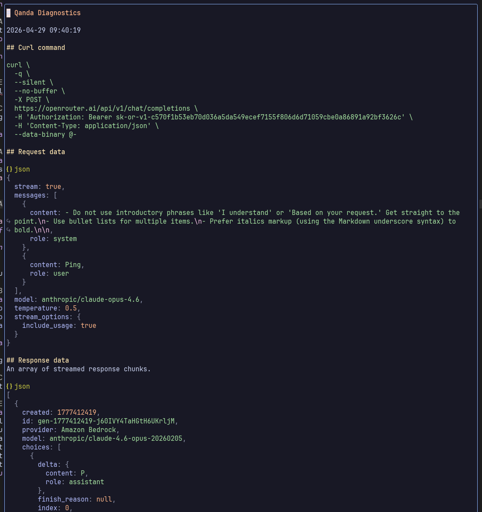

# qanda.nvim

Qanda is an AI chatbot for Neovim.

An easy-to-use Neovim plugin for conversing with AI models.

## Overview

Qanda is for getting answers and performing tasks interactively, not for automated workflow execution. It is first and foremost designed for easy on-boarding with a familiar prompt/response chat UI that doesn't get in your way.

There are plenty of feature-rich AI applications AI plugins out there and most are not designed for quick-fire Q&A sessions. Most are coding oriented, opinionated, and come with a significant cognitive load.

Qanda features:

- Familiar turn-about chatbot UI.
- Chats are persistent, resumable and editable.
- Ollama, OpenRouter and Google Gemini model providers.
- Models and providers can be switched at any time.
- Reusable named [prompt templates](#prompt-and-system-templates) canned prompts and [system templates](#prompt-and-system-templates) for custom [system messages](#system-messages).
- The user engages in interactive turn-about _chats_ (conversations) with the selected AI model.
- _Chats_ are contextual, persistent, resumable and editable.
- The chat comprises one or more _turns_ (model request + model response).
- A turn is initiated with a user _prompt_ (a question or an instruction)
- Chats can include an optional _[system message](#system-messages)_
- Qanda is light on token consumption: model requests are explicit (there are no hidden contexts or model requests).

## Table of contents

- [Overview](#overview)
- [Glossary of terms](#glossary-of-terms)
- [Configuration](#configuration)
- [Qanda commands](#qanda-commands)
- [Prompt window](#prompt-window)
- [Chat window](#chat-window)
- [Prompt template picker](#prompt-template-picker)
- [System template picker](#system-template-picker)
- [Chat picker](#chat-picker)
- [Turn picker](#turn-picker)
- [Provider picker](#provider-picker)
- [Model picker](#model-picker)
- [Recent model picker](#recent-model-picker)
- [Diagnostics window](#diagnostics-window)
- [Data files](#data-files)
- [Data directories](#data-directories)
- [Prompt and System templates](#prompt-and-system-templates)
- [System messages](#system-messages)
- [Model options](#model-options)
- [Tips](#tips)

## Glossary of terms

- _chat_: An ordered series of model requests and responses pairs (turns) representing a single turn-based conversation.
- _turn_: (or "turn-about") is one full back-and-forth LLM request and response.
- _request_: The prompt, context and [model options](#model-options) sent to the model.
- _response_: Data returned by the model and streamed to the [chat window](#chat-window) in response to a request.
- _context_: Each chat maintains it's own context comprising the chat's [system message](#system-messages), user prompts, and model responses. When a new prompt is submitted to the model it is accompanied by current context.
- _prompt_: User questions and instructions submitted to the AI model from the [prompt window](#prompt-window).

> [!NOTE]
> A user prompt is not the same as a model request; a model request includes the user prompt along with the chat context ([system message](#system-messages) plus previous requests and responses) and [model options](#model-options).

## Configuration

Here is a minimal [lazy.nvim](https://github.com/folke/lazy.nvim) plugin configuration file (typically located in `~/.config/nvim/lua/plugins`):

```lua
return {
  "srackham/qanda.nvim",
  dependencies = {
    "nvim-telescope/telescope.nvim",
  },
  config = function()
    require("qanda").setup {
    -- Override default options here --
    }
  end,
}
```

- You'll also want to set up some key mappings, you'll find examples in this [example plugin configuration file](examples/example-qanda-configuration.lua).
- The full list of configuration options along with their default values can be found in [lua/qanda/config.lua](lua/qanda/config.lua).

> [!NOTE]
> The current release has been tested on NixOS Linux with Neovim v0.11.6.

### Authentication

Provider API keys are imported from exported shell environment variables, the variable name is specified in a provider specific `api_key` configuration option. Here are the default provider options:

```lua
-- Provider specific options
provider_options = {
  openrouter = { api_key = "$OPENROUTER_API_KEY" },
  gemini = { api_key = "$GEMINI_API_KEY" },
},
```

You could set the `api_key` with the actual key value, but this is not recommended for security reasons.

## Qanda commands

- Qanda commands respond to tabbed command completion.
- See the [Example plugin configuration file](examples/example-qanda-configuration.lua) for example command key-mappings.

| Command                         | Description                                                     |
| ------------------------------- | --------------------------------------------------------------- |
| `:Qanda <prompt template name>` | Execute a named [prompt template](#prompt-and-system-templates) |
| `:Qanda /abort`                 | Abort the current model request                                 |
| `:Qanda /chat_picker`           | Open the [Chat picker](#chat-picker)                            |
| `:Qanda /chat_window`           | Open the [Chat window](#chat-window)                            |
| `:Qanda /dump_diagnostics`      | Display diagnostics for the previous model request              |
| `:Qanda /model_picker`          | Select a model from the current provider                        |
| `:Qanda /new_chat`              | Start a new Chat                                                |
| `:Qanda /new_prompt`            | Open a new Prompt                                               |
| `:Qanda /prompt_picker`         | Open the [Prompt picker](#prompt-template-picker)               |
| `:Qanda /prompt_window`         | Open the [Prompt window](#prompt-window)                        |
| `:Qanda /provider_picker`       | Select a provider and a model                                   |
| `:Qanda /prune_chats`           | Delete old chat files                                           |
| `:Qanda /recent_models`         | Select from the list of recent models                           |
| `:Qanda /status`                | Print Qanda status information                                  |
| `:Qanda /system_message_picker` | Open the [System Message picker](#system-template-picker)       |
| `:Qanda /turn_picker`           | Open the chat [Turn picker](#turn-picker)                       |

## Prompt window

> [!NOTE]
> The documentation lists the default key bindings for Qanda window commands; all mappings are [configurable](lua/qanda/config.lua).


The Prompt window is a floating window into which the user enters questions and instructions for the AI model. Prompt submission generates a model request which is appended, with the model response, to the chat's history file.

- A prompt is submitted for execution from the prompt window or directly with a `:Qanda <prompt template name>` command.
- A new prompt can be created with the `:Qanda /new_prompt`, with the `:Qanda /prompt_picker` command, or by resubmitting a previous prompt from the [Chat window](#chat-window).
- The Prompt window implements the following key-mapped commands:
  - `<S-Enter>` - Submit the prompt to the current chat
  - `<C-s>` - Submit the prompt to a new chat
  - `<C-r>` - Submit the prompt, replacing the latest turn in the current chat
  - `<C-Del>` - Clear the prompt window and enter insert mode
  - `<Tab>` - Switch to the [chat window](#chat-window) †
  - `<Esc>` - Close the prompt window †
  - `<Leader>fi` - Inject file(s) into the prompt as Markdown (the file path followed by the fenced contents)†
  - `<C-h>` - List key-mapped commands

† Normal mode commands

## Chat window


The Chat window displays a chat, one turn at a time. Open the chat window with the `:Qanda /chat_window` command, or from the _[chat picker](#chat-picker)_ or _[prompt window](#prompt-window)_.

- A new chat can be created with the `:Qanda /new_chat` command or directly from the _[prompt window](#prompt-window)_.
- Chats are saved automatically at each turn and the chat window is updated with streamed response messages from model.
- The most recent chat is restored when you restart Neovim.
- Use the _[chat picker](#chat-picker)_ to select and resume previous conversations.
- The chat window is read-only, you can't edit it directly.
- By default, the chat window is a floating window (see the `chat_window_mode` [configuration](#configuration) option).
- Scroll the chat window turn-wise with the next (`<C-n>`) and previous (`<C-p>`) key-mapped commands.
- The turn in the Chat window can be re-prompted with the `<S-Enter>` key-mapped command — from the [prompt window](#prompt-window) it can be resubmitted using the `<S-Enter>` and `<C-s>` key-mapped commands.
- The chat window implements the following key-mapped commands:
  - `<S-Enter>` - Create a new prompt from the current chat window prompt
  - `<Tab>` - Switch to [prompt window](#prompt-window)
  - `<C-Del>` - Clear the prompt window and enter insert mode
  - `<C-p>/<C-n>` Scroll up/down for previous/next prompt (from the current chat message)
  - `<C-d>` - Delete current turn, if last turn delete the chat
  - `<C-e>` - Open the chat file in the editor at the selected turn (by searching for the timestamp)
  - `<C-r>` - Re-execute the latest turn
  - `<C-k>` - Abort the current request
  - `<Esc>` - Close Chat window
  - `<C-z>` - Toggle truncated fields
  - `<C-h>` - List key-mapped commands

## Prompt template picker


The _prompt template picker_ is used to select a user [prompt template](#prompt-and-system-templates) which is then expanded and opened in the _[prompt window](#prompt-window)_. The _prompt template picker_ is opened with the `:Qanda /prompt_picker` command.

- The prompt template picker implements the following key-mapped commands:
  - `<Enter>` - Expand the prompt template and open in the [prompt window](#prompt-window)
  - `<S-Enter>` - Expand and execute the selected prompt template immediately
  - `<C-e>` - Edit prompt templates file
  - `<Esc>` - Close the picker

## System template picker


The _system template picker_ is used to select and enable or disable the [system message](#system-messages). It is opened with the `:Qanda /system_message_picker` command.

- The system template picker implements the following key-mapped commands:
  - `<Enter>` - Enable system message
  - `<C-d>` - Disable system message
  - `<C-e>` - Edit system message templates file
  - `<Esc>` - Close picker

In addition to setting the default system message:

- Disabling the System Message will delete it from the current Chat.
- Selecting the System Message will assign it to the current Chat.

## Chat picker


The _chat picker_ is used to list, preview, select and manage chats. The `:Qanda /chat_picker` command opens the chat picker.

- The _chat picker_ allows previous chats to be selected and resumed.
- The _chat picker_ chronologically orders chats by creation date based on the chat file name timestamp.
- The most recent chat is restored when the plugin is loaded.
- The default chat name displayed in the chat picker is from the first words of the chat's first turn request (you can rename the chat with the chat picker `<C-s>` key-mapped command).
- The _chat picker_ implements the following key-mapped commands:
  - `<Enter>` - Open chat in the [chat window](#chat-window)
  - `<C-d>` - Delete selected chat
  - `<C-s>` - Rename selected chat
  - `<C-e>` - Edit the chat file
  - `<Esc>` - Close the picker

## Turn picker


The _turn picker_ displays the turns in the current chat, it implements the following key-mapped commands and is opened with the `:Qanda /turn_picker` command:

- `<Enter>` - Open selected turn in the [chat window](#chat-window)
- `<C-d>` - Delete the selected turn
- `<C-z>` - Toggle truncated fields in the preview window
- `<Esc>` - Close the picker

## Provider picker


Selects a model provider. When you select the provider you'll also get prompted to select one of the provider's models. A provider health check is run each time a provider is selected.

The _provider picker_ is opened with the `:Qanda /provider_picker` command and implements the following key-mapped commands:

- `<Enter>` - Select the provider
- `<Esc>` - Close the picker

## Model picker


Selects a model from a list of models belonging to the current provider. Opened with the `:Qanda /model_picker` command.

The _model picker_ implements the following key-mapped commands:

- `<Enter>` - Select the model
- `<Esc>` - Close the picker

## Recent model picker


The _recent model picker_ allow you to quickly switch between recently used models. It is opened with the `:Qanda /recent_models`
command and implements the following key-mapped commands:

- `<Enter>` - Select the model
- `<Esc>` - Close the picker

Displayed model names are formatted like `<provider>/<model>`.

## Diagnostics window



The _diagnostics window_ displays the underlying commands and data from the most recent model request. It is opened with the `:Qanda /dump_diagnostics` command and responds the following key-mapped commands:

- `<Esc>` or `q` - Close the diagnostics window.

If you have `jq` installed then diagnostics JSON data will be pretty-printed.

If Neovim is configured to persist the Neovim registers across sessions, then the Qanda `/dump_diagnostics` command will also persist across sessions. Set the maximum number of shada lines saved to accommodate the diagnostics e.g. to 999:

      vim.opt.shada = "!,'100,<999,s10,h"

## Data files

Qanda maintains a number of history and session data files:

- The `session.json` file contains the session state which is restored at startup. It contains:
  - Current provider and model names
  - Most recently used chat file name
  - Current [system message](#system-messages) template name
  - The list of recently used models
- The `chats` directory containing chat files:
  - Each chat is saved in a separate [JSONL](https://jsonlines.org/) file named like `<creation-date>.chat.json` with date format `YYYYMMDD_HHMMSS` e.g. `20260224_104421.chat.jsonl`.
  - Within each chat file is a chronologically ordered list of JSON-formatted turn objects.

- The `prompts` directory containing [prompt and system template](#prompt-and-system-templates) files.

## Data directories

Qanda [data files](#data-files) are sourced from two locations:

- The global Qanda data directory which is set by the `data_dir` [configuration](#configuration) option and defaults to `vim.fn.stdpath "data" .. "/qanda_nvim"` (usually `~/.local/share/nvim/qanda_nvim` on Linux).
- An optional Qanda local data directory `$PWD/.qanda_nvim`

If an optional local directory exists then it will source `session.json` and, optionally, templates and chats files from the `prompts` and `chats` subdirectories respectively.

- The `chats` directory contains the saved chats history (one file per chat).
- The `prompts` directory contains the user [prompt templates](#prompt-and-system-templates) and [system message](#system-messages) templates.
- If there is no local `chats` folder Qanda uses the global `chats` folder.
- If there is no local `prompts` folder Qanda uses the global `prompts` folder.

This scheme allows you to selectively share sessions, [templates](#prompt-and-system-templates) and chats across projects.

Local data storage is initiated by creating a directory called `.qanda_nvim` in the project root directory. Creating sub-directories `prompts` and `chats` will confine prompt templates and chats to the project, otherwise they are sourced from the global locations.

For example, executing the `mkdir -p .qanda_nvim/chats` shell command in the project root directory creates the local data folder and a sub-folder for chats files; since we didn't create a `prompts` templates folder, they will be sourced from the global data store.

## Prompt and System templates

Named templates for user prompts and [system messages](#system-messages) are selected and managed with the _[prompt template picker](#prompt-template-picker)_ and _[system template picker](#system-template-picker)_ respectively.

Both template types share the same text file format; they generate model request messages with "user" and "system" roles respectively.

- Templates are stored (one or more per file) in the directory set by the `prompts_dir` [configuration](#configuration) option (it defaults to `~/.local/share/nvim/qanda_nvim/prompts/` on most Linux systems).
- Template files are named like `*.user.md` or `*.system.md`.
- Templates can contain [template placeholders](#template-placeholders) which are expanded into the user prompt and system message.

### Template placeholders

The following placeholders can be used in [prompt and system templates](#prompt-and-system-templates).

| Syntax                          | Description                                                       |
| ------------------------------- | ----------------------------------------------------------------- |
| `$input`, `${input:<prompt>}` † | Prompts user for input and substitutes the input                  |
| `${file:<file name>}`           | Inject text file                                                  |
| `$files` †                      | Prompts the user with a file picker and inject the file(s)        |
| `$clipboard`                    | Substitutes content of system clipboard (alias for `$register_+`) |
| `$yanked`                       | Substitutes most recently yanked text (alias for `$register_0`)   |
| `$register_<register name>`     | Substitutes content of specified register                         |

† Prompt templates only

- The `${file:<file name>}` placeholder injects the raw file; the `$files` placeholder injects the file as Markdown (the file path followed by the fenced contents).
- The `${file:<file name>}` placeholder file location is determined by the file name directory prefix:
  - No directory prefix defaults to the Qanda `prompts` [data directory](#data-directories) e.g. `${file:RULES.md}`
  - A relative directory prefix is relative to the current working directory (reported by the `:pwd` command) e.g. `${file:./README.md}`
  - An absolute directory prefix can be used to specify any location e.g. `${file:~/.config/nvim/stylua.toml}`

### Template format

A template is a Markdown text file containing one or more templates separated by a template header.

A template header consists of one or more property declarations formatted like `<name>: <value>` and delimited top and bottom by a line containing three underscore characters.

- The `name` property is the displayed template name and is mandatory, all other properties are optional and are assumed to be [model options](#model-options).

Example prompt template:

```
___
name: Synonyms
___
List synonyms for "${input:Enter word}"
```

System templates can use the same [placeholders](#template-placeholders) as prompt templates (with the exception of interactive placeholders). Here are a couple of examples of system templates:

```
___
name: Generic
temperature: 0.5
___
${file:GENERIC_RULES.md}

___
name: Sarcastic math teacher
___
You are a sarcastic math tutor. Use LaTeX for formulas.
```

## System messages

The System Message (sometimes called the system prompt or system instruction) is the "rulebook" you give an AI which shapes the LLM's persona. Models weigh the system prompt heavily throughout the entire chat.

Qanda provides control and customisation of system messages with the _[system template picker](#system-template-picker)_. If a System Message has been set, then it will be included in the chat's first turn.

## Model options

Model options are named parameters that are passed to the model in the request data sent to the mode. They include the likes of `temperature`, `max_tokens` etc. Model options are often provider or model specific.

A Qanda request merges model options from:

- The provider specific `provider_options` [configuration](#configuration) option (**lowest precedence**). All options except `api_key` are passed through as AI model request options. Example:

```lua
provider_options = {
  ollama = { think = true, stream = true },
},
```

- The model specific `model_options` [configuration](#configuration) option. Model names are formatted like `<provider>/<model>`. Example:

```lua
model_options = {
  ["ollama/minimax-m2.5:cloud"] = { think = true, temperature = 0.7 },
},
```

- [System template](#prompt-and-system-templates) headers.
- [Prompt template](#prompt-and-system-templates) headers.
- [User prompt](#prompt-window) header (**highest precedence**).

## Tips

- The [chat](#chat-window) and [prompt](#prompt-window) window's `<C-h>` help command displays a summary of key-mapped window commands.
- Use the `:Qanda /dump_diagnostics` command to view the model request and response generated by the most recently executed turn.

- Executing a prompt template from the _[prompt template picker](#prompt-template-picker)_ previews the expanded prompt in the _[prompt window](#prompt-window)_; the preview will be skipped if you execute a prompt template directly using the `:Qanda <prompt template name>` command.
