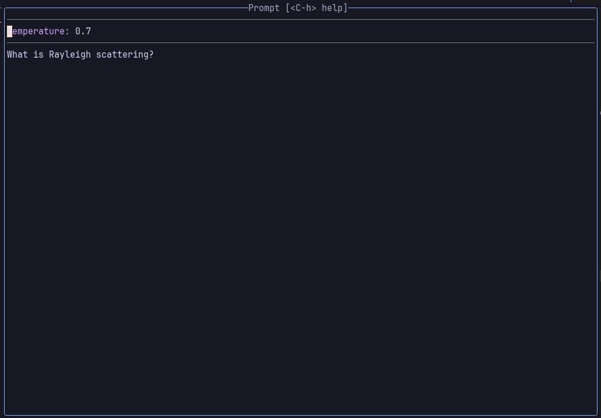
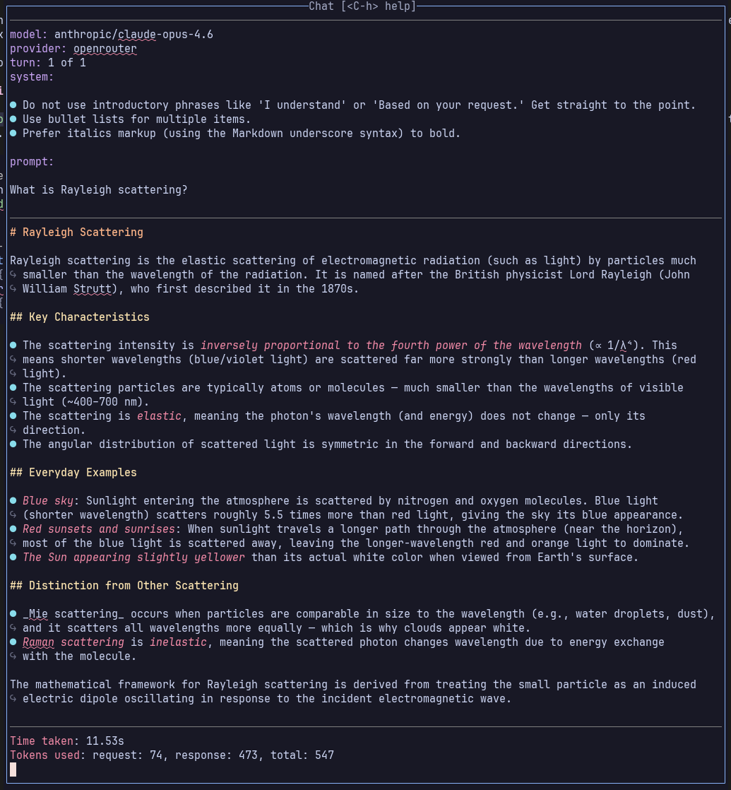
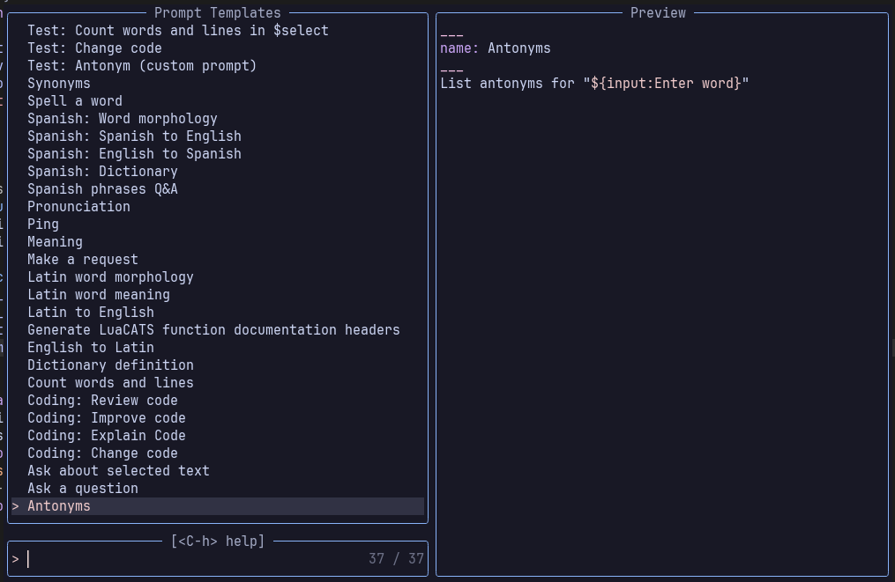
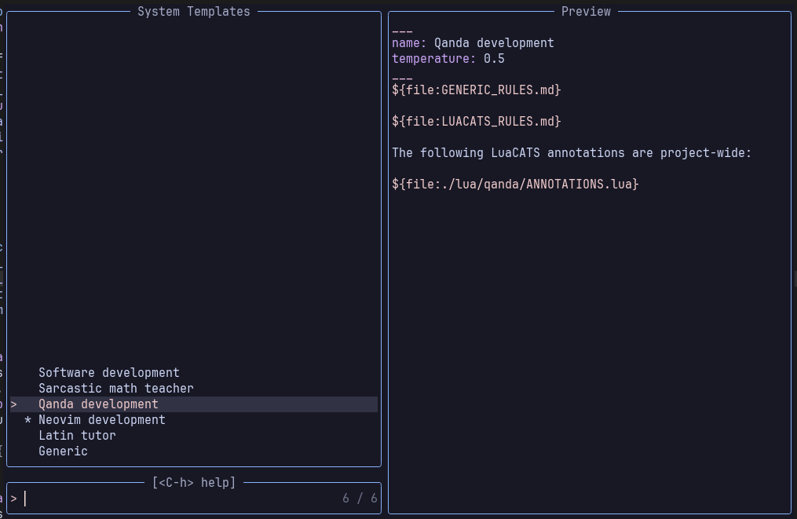
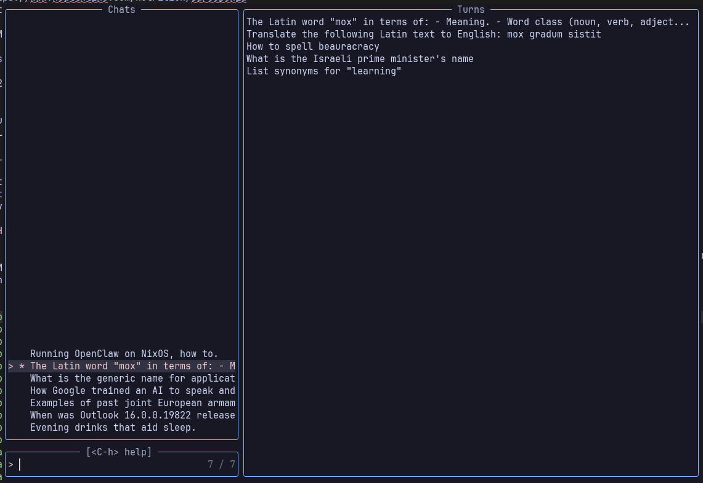
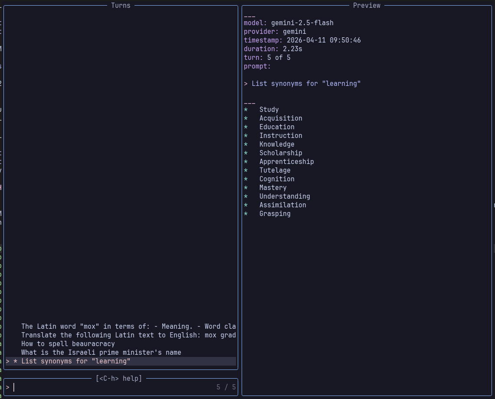
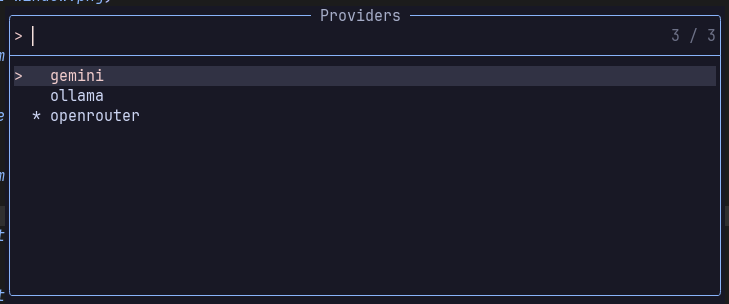
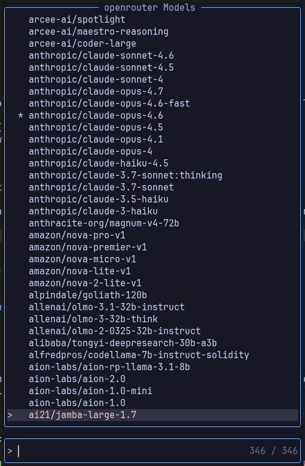
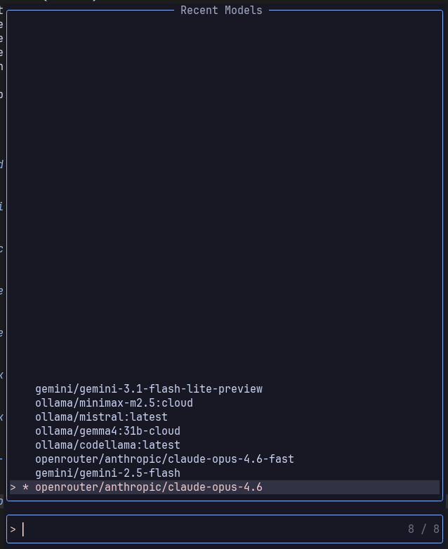
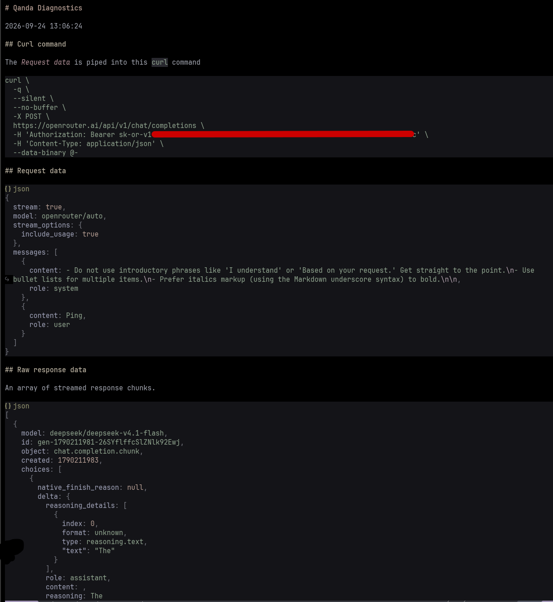

# qanda.nvim

Qanda is an AI chatbot for Neovim.

An easy-to-use Neovim plugin for conversing with AI models.

## Overview

Qanda is for getting answers and performing tasks interactively, not for automated workflow execution. It is designed for easy onboarding with a familiar prompt/response chat UI.

There are plenty of feature-rich AI plugins out there and most are not designed for quick Q&A sessions. Most are coding oriented, opinionated, and have a steep learning curve.

## Table of contents

- [Overview](#overview)
- [Glossary of terms](#glossary-of-terms)
- [Configuration](#configuration)
- [Qanda commands](#qanda-commands)
- [Prompt window](#prompt-window)
- [Chat window](#chat-window)
- [Prompt template picker](#prompt-template-picker)
- [System template picker](#system-template-picker)
- [Chat picker](#chat-picker)
- [Turn picker](#turn-picker)
- [Provider picker](#provider-picker)
- [Model picker](#model-picker)
- [Recent model picker](#recent-model-picker)
- [Diagnostics window](#diagnostics-window)
- [Data files](#data-files)
- [Data directories](#data-directories)
- [Prompt and System templates](#prompt-and-system-templates)
- [System messages](#system-messages)
- [Model options](#model-options)
- [Tips](#tips)

## Quick start

TODO:

## Qanda features

- Familiar turn-about chatbot UI.
- Chats are persistent, resumable and editable.
- Ollama, OpenRouter and Google Gemini model providers.
- Models and providers can be switched at any time.
- Reusable named [prompt templates](#prompt-and-system-templates) canned prompts and [system templates](#prompt-and-system-templates) for custom [system messages](#system-messages).
- The user has interactive _chats_ (conversations) with the selected AI model.
- _Chats_ are contextual, persistent, resumable and editable.
- Each _turn_ (model request + model response) consists of a user prompt and the model's response.
- A turn starts when the user sends a _prompt_ (a question or an instruction).
- Chats can include an optional _[system message](#system-messages)_.
- Qanda minimizes token use: model requests are explicit with no hidden contexts or automatic requests.

## Glossary of terms

- _chat_: An ordered series of model requests and responses pairs (turns) representing a single turn-based conversation.
- _turn_: (or "turn-about") is one full back-and-forth LLM request and response.
- _request_: The user prompt, the context and the [model options](#model-options) sent to the model.
- _response_: Data returned by the model and streamed to the [chat window](#chat-window) in response to a request.
- _context_: Each chat maintains its own context comprising the chat's [system message](#system-messages), previous user prompts and the corresponding model responses. When you submit a new user prompt, it includes the current context.
- _prompt_: User questions or instructions submitted to the AI model from the [prompt window](#prompt-window).

> [!NOTE]
> A user prompt is not the same as a model request; a model request includes the user prompt along with the chat context ([system message](#system-messages) plus previous requests and responses) and [model options](#model-options).

## Configuration

Here is a minimal [lazy.nvim](https://github.com/folke/lazy.nvim) plugin configuration file (typically located in `~/.config/nvim/lua/plugins`):

```lua
return {
  "srackham/qanda.nvim",
  dependencies = {
    "nvim-telescope/telescope.nvim",
  },
  config = function()
    require("qanda").setup {
    -- Override default options here --
    }
  end,
}
```

- Set up some [key mappings](#key-mappings) to use the plugin.
- The full list of configuration options along with their default values can be found in [lua/qanda/config.lua](lua/qanda/config.lua).

> [!NOTE]
> The current release has been tested on NixOS Linux with Neovim v0.11.6.

### Providers

Qanda.nvim supports the following model providers:

| Name         | Provider             |
| ------------ | -------------------- |
| `gemini`     | Google Gemini models |
| `ollama`     | Ollama models        |
| `openrouter` | OpenRouter models    |

Use the `:Qanda /provider_picker` command to select a provider and the `:Qanda /model_picker` command to select a provider model.

### Authentication

Provider API keys come from exported shell environment variables. The variable name is specified in the provider's `api_key` configuration option. Here are the default provider options:

```lua
-- Provider specific options
provider_options = {
  openrouter = { api_key = "$OPENROUTER_API_KEY" },
  gemini = { api_key = "$GEMINI_API_KEY" },
},
```

You could set the `api_key` with the actual key value, but this is not recommended for security reasons.

### Key mappings

There are two types of key mappings: _[Vim key mappings](#vim-key-mappings)_ and _[built-in key mappings](#built-in-key-mappings)_, both are user configurable.

#### Vim key mappings

These are the standard Vim key mappings in a Neovim configuration file. They map a key sequence to a `:Qanda` command. Examples are in this [example plugin configuration file](examples/example-qanda-configuration.lua).

#### Built-in key mappings

These are configurable key sequences for the built-in pickers, mapped to picker-specific commands.

- To list a picker's key commands and their assigned key sequences, open the picker and enter `<C-h>`.
- These configuration options are named like `*_KEY` and the full list of names, along with their default values, can be found in [lua/qanda/config.lua](lua/qanda/config.lua).

> [!TIP]
> To disable a _[built-in key mapping](#built-in-key-mappings)_ set the configuration key to `"<NOP>"` (the do nothing no-op key sequence).

#### Default key mappings

The default mappings include:

- `<S-Tab>` toggles between the Chat and Prompt windows.
- `<S-Tab>` opens the Chat window from an edit buffer†, hit `<S-Tab>` twice to switch to the Prompt window.
- `<C-Del>` (_Ctrl+Delete_) opens a blank Prompt window in insert mode from Chat and Prompt windows and from an edit buffer†.
- `<C-h>` lists available picker commands for the current picker.

† See the Vim mappings in the [example plugin configuration file](examples/example-qanda-configuration.lua).

## Chat Mode

A new turn is either appended to the current chat (_current_ chat mode) or to a newly created chat (_new_ chat mode).

If the `new_chat_mode` [configuration option](#configuration) is `true` the chat mode is _new_ and the default destination is a new chat, if `false` the chat mode is _current_ and the default destination is the current chat.

The default chat mode can be overridden by appending `␣+` (a space followed by a plus) to Qanda _Template_ commands and _Prompt_ commands. Examples:

| Command                   | `new_chat_mode` Option | Turn Destination |
| ------------------------- | ---------------------- | ---------------- |
| `:Qanda !Query`           | `true`                 | New chat         |
| `:Qanda !Query +`         | `true`                 | Current chat     |
| `:Qanda ?Four plus one`   | `false`                | Current chat     |
| `:Qanda ?Four plus one +` | `false`                | New chat         |

Appending `␣+` to an `$input` [placeholder's](#template-placeholders) user input also overrides the default chat mode. Examples:

| Input    | `new_chat_mode` Option | Turn Destination |
| -------- | ---------------------- | ---------------- |
| `Ping`   | `true`                 | New chat         |
| `Ping +` | `true`                 | Current chat     |
| `Ping`   | `false`                | Current chat     |
| `Ping +` | `false`                | New chat         |

## Qanda commands

There are three types of Qanda commands:

- _Builtin commands_: Execute a builtin command (`:Qanda /<command>`)
- _Template commands_: Execute a prompt template (`:Qanda !<template>`)
- _Prompt commands_: Execute a user prompt (`:Qanda ?<prompt>`)

| Command                          | Description                                                     |
| -------------------------------- | --------------------------------------------------------------- |
| `:Qanda`                         | Open the [Prompt template picker](#prompt-template-picker)      |
| `:Qanda !<template>`             | Execute a named [prompt template](#prompt-and-system-templates) |
| `:Qanda ?<prompt>`               | Execute a user prompt                                           |
| `:Qanda /abort`                  | Abort the current model request                                 |
| `:Qanda /chat_picker`            | Open the [Chat picker](#chat-picker)                            |
| `:Qanda /chat_window`            | Open the [Chat window](#chat-window)                            |
| `:Qanda /dump_diagnostics`       | Display diagnostics for the previous model request              |
| `:Qanda /model_picker`           | Select a model from the current provider                        |
| `:Qanda /new_chat`               | Start a new Chat                                                |
| `:Qanda /new_prompt`             | Open a new Prompt                                               |
| `:Qanda /prompt_template_picker` | Open the [Prompt picker](#prompt-template-picker)               |
| `:Qanda /prompt_window`          | Open the [Prompt window](#prompt-window)                        |
| `:Qanda /provider_picker`        | Select a provider and a model                                   |
| `:Qanda /recent_models`          | Select from the list of recent models                           |
| `:Qanda /status`                 | Print Qanda status information                                  |
| `:Qanda /system_template_picker` | Open the [System template picker](#system-template-picker)      |
| `:Qanda /turn_picker`            | Open the chat [Turn picker](#turn-picker)                       |

- Qanda commands respond to tabbed command completion.
- `:Qanda !<template>` commands execute immediately cf. the [Prompt template picker](#prompt-template-picker) which previews the prompt in the Prompt window.
- The `:Qanda !<template>` command creates a new chat unless the user enters an [input placeholder](#template-placeholders) value that ends in a space character followed by a `+` character, in which case the new turn will be appended to the current chat.
- Templates containing the `$cursor` placeholder are always previewed in the Prompt window.

## Prompt window



The Prompt window is a floating window where you enter questions and instructions for the AI model. When you submit a prompt, the model request and response are appended to the chat's history file.

- Submit a prompt from the prompt window or with a `:Qanda !<template>` command.
- Create a new prompt with `:Qanda /new_prompt`, `:Qanda /prompt_template_picker`, or by resubmitting a previous prompt from the [Chat window](#chat-window).
- The Prompt window implements the following key-mapped commands (these mappings are [configurable](lua/qanda/config.lua)):
  - `<C-q>` - Default prompt submission
  - `<C-a>` - Submit the prompt with the current chat
  - `<C-n>` - Submit the prompt in a new chat
  - `<C-r>` - Submit the prompt with the current chat replacing the latest turn
  - `<C-Del>` - Clear the prompt window and enter insert mode
  - `<S-Tab>` - Switch to the Chat window †
  - `<Esc>` - Close the Prompt window †
  - `<Leader>fi` - Inject file(s) into the prompt †
  - `<C-h>` - List key-mapped commands

† Normal mode commands

## Chat window



The Chat window shows a chat, one turn at a time. Open it with `:Qanda /chat_window`, the _[chat picker](#chat-picker)_, or the _[prompt window](#prompt-window)_.

- A new chat can be created with the `:Qanda /new_chat` command or directly from the _[prompt window](#prompt-window)_.
- Chats are saved after each turn and the chat window updates with streamed response messages from the model.
- The most recent chat appears when you restart Neovim.
- Use the _[chat picker](#chat-picker)_ to select and resume previous conversations.
- The chat window is read-only, you can't edit it directly.
- By default, the chat window is a floating window (see the `chat_window_mode` [configuration](#configuration) option).
- Scroll through turns with the next (`<C-n>`) and previous (`<C-p>`) commands.
- The chat window implements the following key-mapped commands:
  - `<S-Tab>` - Switch to the Prompt window
  - `<C-Del>` - Open a blank Prompt window in insert mode
  - `<C-c>` - Copy the turn response to clipboard
  - `<Esc>` - Close the Chat window
  - `<C-n>/<C-p>` Go to next/previous turn
  - `<C-k>` - Abort the current request
  - `<C-d>` - Delete the current turn, if it is the last turn delete the chat
  - e - Open the chat file in the editor at the selected turn
  - p - Open the current turn's prompt in the Prompt window
  - r - Delete the latest turn from the chat and open its prompt in the Prompt window
  - t - Toggle truncated prompt and system message fields
  - `<C-h>` - List key-mapped commands

## Prompt template picker



The _prompt template picker_ is used to select a user [prompt template](#prompt-and-system-templates) which is then expanded and opened in the _[prompt window](#prompt-window)_. The _prompt template picker_ is opened with the `:Qanda /prompt_template_picker` command.

- The prompt template picker implements the following key-mapped commands:
  - `<Enter>` - Expand the prompt template and open in the [prompt window](#prompt-window)
  - `<C-x>` - Expand and execute the selected prompt template
  - `<C-e>` - Edit prompt templates file
  - `<Esc>` - Close the picker
  - `<C-h>` - List key-mapped commands

## System template picker



The _system template picker_ is used to select and enable or disable the [system message](#system-messages). It is opened with the `:Qanda /system_template_picker` command.

- The system template picker implements the following key-mapped commands:
  - `<Enter>` - Enable the system message
  - `<C-d>` - Disable the system message
  - `<C-e>` - Edit the system message templates file
  - `<Esc>` - Close the picker
  - `<C-h>` - List key-mapped commands

In addition to setting the default system message:

- Disabling the system message will delete it from the current Chat.
- Selecting the system message will assign it to the current Chat.

## Chat picker



The _chat picker_ is used to list, preview, select and manage chats. The `:Qanda /chat_picker` command opens the chat picker.

- The _chat picker_ allows previous chats to be selected and resumed.
- The _chat picker_ orders chats by creation date using the chat file name timestamp.
- The chat picker _Preview window_ lists the chat turns from first to last, if there is only one turn then the turn is displayed.
- The most recent chat appears when the plugin loads.
- The default chat name comes from the first words of the chat's first turn request (rename with the chat picker `<C-l>` command).
- The _chat picker_ implements the following key-mapped commands:
  - `<Enter>` - Open the selected chat in Chat window
  - `<C-t>` - Open the selected chat in the Turn picker
  - `<C-d>` - Delete the selected chat
  - `<C-l>` - Rename a selected chat
  - `<C-e>` - Edit the chat file
  - `<Esc>` - Close the picker
  - `<C-h>` - List key-mapped commands

## Turn picker



The _turn picker_ displays the turns in the current chat, it implements the following key-mapped commands and is opened with the `:Qanda /turn_picker` command:

- `<Enter>` - Open the selected turn in the Chat window
- `<C-x>` - Open Prompt window with selected turn's prompt
- `<C-d>` - Delete the selected turn
- `<C-z>` - Toggle truncated fields in the Preview
- `<Esc>` - Close the picker
- `<C-h>` - List key-mapped commands

## Provider picker



Selects a model provider. When you select the provider you'll also get prompted to select one of the provider's models. A provider health check is run each time a provider is selected.

The _provider picker_ is opened with the `:Qanda /provider_picker` command and implements the following key-mapped commands:

- `<Enter>` - Select the provider
- `<Esc>` - Close the picker

## Model picker



Selects a model from the current provider. Open with `:Qanda /model_picker`.

The _model picker_ implements the following key-mapped commands:

- `<Enter>` - Select the model
- `<Esc>` - Close the picker

## Recent model picker



The _recent model picker_ lets you switch between recently used models. Open it with `:Qanda /recent_models`.
It implements these commands:

- `<Enter>` - Select the model
- `<Esc>` - Close the picker

Displayed model names are formatted like `<provider>/<model>`.

## Diagnostics window



The _diagnostics window_ shows the commands and data from the most recent model request. Open it with `:Qanda /dump_diagnostics`. It responds to these commands:

- `<Esc>` or `q` - Close the diagnostics window.

If you have `jq` installed then diagnostics JSON data will be pretty-printed.

If Neovim is configured to persist registers across sessions, the Qanda `/dump_diagnostics` command also persists. Set the maximum number of shada lines to accommodate the diagnostics, for example 999:

      vim.opt.shada = "!,'100,<999,s10,h"

## Data files

Qanda maintains a number of history and session data files:

- The `session.json` file contains the session state restored at startup:
  - Current provider and model names
  - Most recently used chat file name
  - Current [system message](#system-messages) template name
  - List of recently used models
- The `chats` directory contains chat files:
  - Each chat is in a separate [JSONL](https://jsonlines.org/) file named `<creation-date>.chat.json` with date format `YYYYMMDD_HHMMSS` (e.g. `20260224_104421.chat.jsonl`).
  - Each chat file contains a chronologically ordered list of JSON-formatted turn objects.

- The [prompt and system template](#prompt-and-system-templates) files.

## Data directories

Qanda [data files](#data-files) are sourced from two locations:

- The _global data directory_ is set by the `data_dir` [configuration](#configuration) option and defaults to `vim.fn.stdpath "data" .. "/qanda_nvim"` (usually `~/.local/share/nvim/qanda_nvim` on Linux).
- An optional _project data directory_ `$PWD/.qanda_nvim`
- Project data directory files take priority.
- If there is no project `.qanda/chats` folder, Qanda uses the global chats folder.
- [User prompt templates and system message templates](#prompt-and-system-templates) always come from the _global data directory_.

## Prompt and System templates

Named templates for user prompts and [system messages](#system-messages) are selected and managed with the _[prompt template picker](#prompt-template-picker)_ and _[system template picker](#system-template-picker)_ respectively.

Both _[template types](#prompt-and-system-templates)_ use the same text file format. They generate model request messages with "user" and "system" roles.

- _[Templates](#prompt-and-system-templates)_ are in the `templates` subdirectory of the global data directory (defaults to `~/.local/share/nvim/qanda_nvim/templates/` on Linux).
- Template files are named like `*.user.md` or `*.system.md`.
- Templates can contain [template placeholders](#template-placeholders) which are expanded to the user prompt and system message.

### Template format

A template is a Markdown text file containing one or more templates separated by a template header.

A template header has one or more property declarations like `<name>: <value>`, delimited top and bottom by a line with three underscore characters.

Example prompt template:

```
___
name: Synonyms
___
List synonyms for "${input:Enter word}"
```

System templates can use the same [placeholders](#template-placeholders) as prompt templates (with the exception of interactive placeholders). Here are a couple of examples of system templates:

```
___
name: Generic
temperature: 0.5
___
${file:GENERIC_RULES.md}

___
name: Sarcastic math teacher
___
You are a sarcastic math tutor. Use LaTeX for formulas.
```

### Template properties

- The `name` property is the displayed template name and is mandatory.
- The optional prompt template `system` property is the name of a system message template.
- All other properties are optional and are assumed to be [model options](#model-options).

### Template placeholders

The following placeholders are used in [prompt and system templates](#prompt-and-system-templates).

| Syntax                          | Description                                                       |
| ------------------------------- | ----------------------------------------------------------------- |
| `$clipboard`                    | Substitutes content of system clipboard (alias for `$register_+`) |
| `$cursor`, `${cursor:<prompt>}` | Positions the cursor in the Prompt window                         |
| `${file:<file name>}`           | Inject text file                                                  |
| `$files`                        | Prompts the user with a file picker and injects the file(s)       |
| `$input`, `${input:<prompt>}`   | Prompts user for input and substitutes the input                  |
| `$register_<register name>`     | Substitutes content of specified register                         |
| `${shell:<command>}`            | Substitutes `stdout` output from shell command                    |
| `$yanked`                       | Substitutes most recently yanked text (alias for `$register_0`)   |

- Placeholders cannot span multiple lines.

- An `$input` placeholder's user input ending with a `␣+` (a space followed by a plus) inverts the default `new_chat_mode` option prompt submission mode:

- Appending `␣+` to an `$input` placeholder's user input overrides the default [`new_chat_mode` option](#new-chat-mode).

- The `${file:<file name>}` placeholder injects the raw file. The `$files` placeholder injects files as Markdown (the file path followed by the fenced contents).

- The `${file:<file name>}` placeholder file location is determined by the file name directory prefix:
  - No directory prefix defaults to the Qanda `templates` [data directory](#data-directories) e.g. `${file:RULES.md}`
  - A relative directory prefix is relative to the current working directory (reported by the `:pwd` command) e.g. `${file:./README.md}`
  - An absolute directory prefix can be used to specify any location e.g. `${file:~/.config/nvim/stylua.toml}`

- The `$cursor` placeholder marks the cursor position when a prompt template loads in the Prompt window. For example, this template loads `List antonyms for ""` into the prompt window, positions the cursor inside the quotes, then switches to insert mode:

      ```
      ___
      name: Antonyms
      ___
      List antonyms for "$cursor"
      ```

- The `${cursor:<prompt>}` syntax displays a prompt message on the status line e.g. `${cursor:Enter a word to find antonyms}`, in all other respects it behaves the same as the `$cursor` syntax.

- The `${shell:<command>}` placeholder is replaced by the output of the shell command.
  - The shell command extends from the colon up to the last `}` character on the line.
  - The shell command runs the command from Neovim’s current working directory.

## System messages

The System Message (sometimes called the system prompt or system instruction) is the "rulebook" you give an AI. It shapes the LLM's behavior. Models follow the system prompt throughout the entire chat.

Qanda provides control and customisation of system messages with the _[system template picker](#system-template-picker)_. If a System Message has been set, then it will be included in the chat's first turn.

## Model options

Model options are parameters passed to the model in the request data. Common options include `temperature` and `max_tokens`. Model options often vary by provider or model.

A Qanda request merges model options from:

- The provider `provider_options` [configuration](#configuration) option (**lowest priority**). All options except `api_key` are passed to the AI model. Example:

```lua
provider_options = {
  ollama = { think = true, stream = true },
},
```

- The model specific `model_options` [configuration](#configuration) option. Model names are formatted like `<provider>/<model>`. Example:

```lua
model_options = {
  ["ollama/minimax-m2.5:cloud"] = { think = true, temperature = 0.7 },
},
```

- [System template](#prompt-and-system-templates) headers.
- [Prompt template](#prompt-and-system-templates) headers.
- [User prompt](#prompt-window) header (**highest priority**).

## Tips

- The [chat](#chat-window) and [prompt](#prompt-window) window's `<C-h>` help command displays a summary of key-mapped window commands.
- Use the `:Qanda /dump_diagnostics` command to view the model request and response from the most recent turn.

- Opening a prompt template with the [prompt template picker](#prompt-template-picker) previews the expanded prompt in the [prompt window](#prompt-window). The preview is skipped if you run the template directly with `:Qanda !<template>`.
